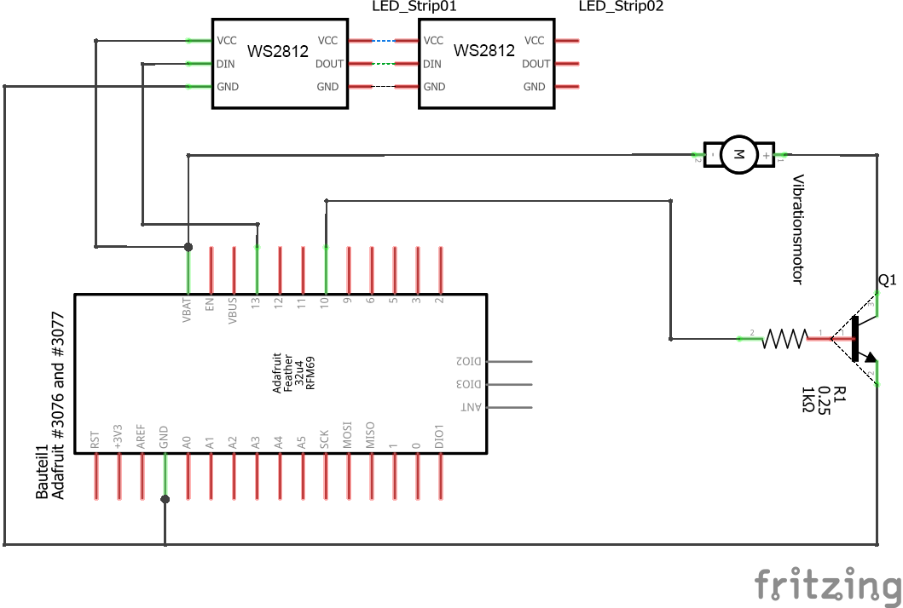
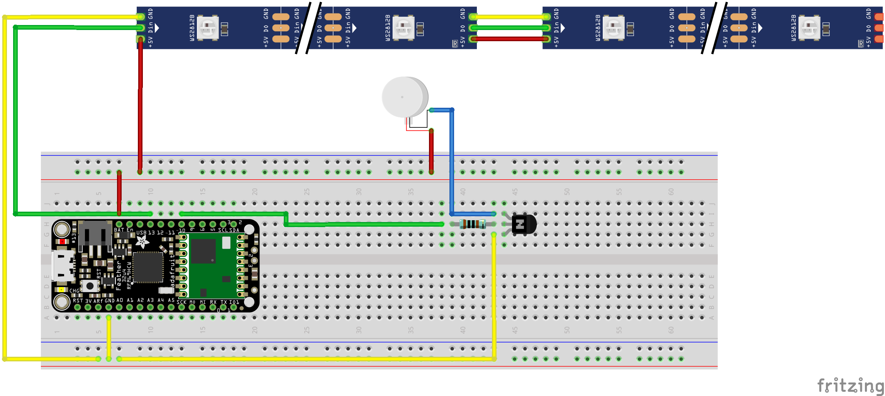

# OPEN PROJECT - HEALTH

Open Project ist ein freies Wahlpflichtfach im Fachbereich Medien an der Hochschule Düsseldorf. In dem Projekt geht es um die digitale bzw. virtuelle Unterstützung der Lehre im medizinischen Bereich durch Tangibles. Dazu wurde ein 3D-Objekt als greifbares Interface zur Veranschaulichung des menschlichen Herzens entwickelt und prototypisch realisiert. 

## ZIELSETZUNG

Ziel des Projektes stellt die prototypische Realisierung eines greifbaren Interfaces zur Unterstützung der Lehre in einem iterativen Prozess dar. Der Prototyp soll Studierenden der Medizin die Anatomie des Herzens vermitteln. Dazu soll mittels LEDs und Vibration ein Herzschlag simuliert werden. Zusätzlich soll das Tangible in Unity angesprochen und verschiedene Funktionen des Tangibles über Unity ausgeführt werden können.

## UMSETZUNG

In einem iterativen Prozess mit insgesamt 4 Sprints wurde die Umsetzung des Prototypen geplant und realisiert. In der ersten Iteration wurde konzeptionell gearbeitet. Dabei wurden verschiedene Tangibles und deren entsprechende Umsetzung recherchiert. Der Fokus lag auf den benötigten Komponenten und den verschiedenen Möglichkeiten ein Tangible zu entwickeln. Aus der Recherche ergaben sich teilweise die Anforderungen an den Prototypen sowie die benötigte Schnittstelle zwischen Unity und dem Tangible. In der zweiten Iteration wurde die Schnittstelle zwschen Unity und dem Tangible (Arduino) den Anforderungen entsprechend angepasst sowie eine erste Version des Tangibles mittels eines 3D-Druckers gedruckt. In den weiteren Iterationen lag der Fokus auf einem passenden 3D-Modell für das Herz, den entsprechenden Anpassungen für die verbaute Elektronik und dem 3D-Druck. Weitere Funktionen bzw. softwareseitige Veränderungen entsprachen in diesen Iterationen überwiegend kosmetischer Natur. </br>
</br>
Die folgende Abbildung zeigt die verschiedenen Komponenten sowie die entsprechenden Funktionen des Tangibles. Diese Komponenten werden in den folgenden Unterkapitel genauer dargestellt und erklärt. </br>


### UNITY

Die Unity Szene besteht lediglich aus einem Würfel und einem Button. Der Würfel dient als Platzhalter für ein Herzmodell. Über einen am physischen Modell angebrachten Vive Tracker werden die Bewegungen des Herzens über den Würfel in der Szene dargestellt. Der Button dient zur (De-)Aktivierung des simulierten Herzschlags. Die ausführliche Erklärung kann in dem Abschnitt **Senden und Empfangen der Daten** nachgelesen werden. </br>

```bash
├── ViveTrackerTest
│   ├── Assets
│   │   ├── Scenes
│   │   │   ├── SampleScene.unity # Scene with example buttons and outputs
│   │   ├── Scripts
│   │   │   ├── ArduinoConnector.cs # Communication with Arduino
│   │   │   └── TrackerInput.cs # Communication with ViveTracker. Uses ArduinoConnector to send messages
│   │   ├── SteamVR
└── └── ... # Standard Unity project files
```

TO DO: SCHALTPLAN TRACKER

- **SteamVR**</br>
Hier Erklärung:
- Tracker in SteamVR
- Probleme: Brille und Controller rauswerfen, damit Vive Tracker in Unity erkannt wird

### ARDUINO (ADAFRUIT)
Für das Projekt wurden zwei Adafruit Feather Boards verwendet. Ein Adafruit dient als Transmitter und wird an dem PC oder Laptop angeschlossen, andem die Unity Szene gestartet wird. Dieser dient als **Transmitter**. Der zweite Adafruit ist im Herzen verbaut und wird über einen Akku versorgt. Dieser wird als **Receiver** verwendet. Die Kommunikation der beiden Adafruits findet über eine 433 MHz Radio-Frequenz statt. Der Receiver ist für die Steuerung der LEDs und der Vibration, also der Simulation des Hertschlags, zuständig. Eine ausführliche Erklärung zur Logik kann in dem Abschnitt **Senden und Empfangen der Daten** nachgelesen werden.

```bash
├── arduino
│   ├── receiver
│   │   ├── receiver_led.ino # Receive messages on Adafruit connected to the heart
│   ├── transmitter
└── └── └── transmitter.ino # Send messages from Adafruit connected to PC
```



### SENDEN UND EMPFANGEN DER DATEN

Zum Senden an den Adafruit "Receiver", welcher sich im Herzen befindet, wird ein in Unity eingebundenes Skript (ArduinoConnector.cs) verwendet, welches die Informationen über einen COM-Port via USB an den Adafruit "Transmitter" übermittelt, welcher dann das Signal an den Receiver weiterleitet.</br>

</br>
In der Unity-Szene ist das Skript dem Würfel hinzugefügt. Dort kann der COM-Port an dem der Transmitter am Computer angeschlossen ist, festgelegt werden. Ebenso kann die BaudRate angepasst werden.</br>
</br>
Das Skript "ArduinoConnector.cs" verbindet sich beim Start der Szene über den COM-Port mit dem Transmitter. Das Skript stellt verschiedene Funktionen zum verschicken oder empfangen von Daten durch den Transmitter zur Verfügung. In unserem Beispiel verwenden wir nur die SendToArduino(string command) Funktion, welche den übergebenen Befehl in eine Queue setzt. Diese Queue wird fortlaufend in einer Loop überprüft. Falls etwas darin steht, wird über die Funktion WriteToArduino(string message) versucht, die Nachricht über den SerialPort an den Transmitter zu übergeben. Im Transmitter wird die SerialCommands Library verwendet, mit der Events erstellt werden können, die auf ankommende Strings reagieren. Dadurch können beliebig weitere Events hinzugefügt werden.</br>
</br>
Dadurch kann über das TrackerInput.cs Skript, wenn ein Button gedrückt wird, bspw. die Nachricht (als String) "on" oder "off" an den Transmitter geschickt werden. Die jeweiligen Events werten den String aus. Falls ein Event auf den String passt, wird eine Funktion ausgeführt, die eine neue Nachricht (ebenfalls als String) über die 433MHz Radio-Frequenz an den Receiver schickt. Wird also die "on"-Nachricht erkannt, dann wird eine Nachricht mit dem Wert "1" an den Receiver geschickt. Im Receiver wird über die RHReliableDatagram-Library der rf69_manager initialisiert, welcher erkennt ob Nachrichten empfangen werden. In der Loop wird dann überprüft ob im Buffer des rf69_manager eine Nachricht liegt. Ist dies der Fall, wird dieser ausgelesen und in einen Char umgewandelt. Dieser Char setzt dann in der Loop, über eine einfache Switch-Case Abfrage, den led_on-Bool auf true oder false. Je nach Zustand werden in der Loop die Leds und die Vibration entsprechend an- oder ausgeschaltet.

### 3D MODELL

Das Modell besteht aus zwei Hälften. Dafür wurde das Herz horizontal geteilt. An der oberen Hälfte befindet sich ein Steckplatz für einen Button sowie für die Schiene an welcher der Tracker angebracht wird. An der unteren Hälfte befindet sich eine Art Klappe mit einem darunter liegender Button-Steckplatz sowie ein weiterer Button-Steckplatz an der Seite. Für das Modell wurde ein lizensiertes Herzmodell verwendet, welches nicht auf Github hochgeladen werden darf.

- **Software für die Bearbeitung**</br>
Das vorgegebene Modell wurde bereits als STL-Datei zur Verfügung gestellt, weshalb das Modell nur aus Dreiecken bestand. Die Bearbeitung einer solchen Datei ist deutlicher aufwendiger und umständlicher, als die Bearbeitung einer normalen OBJ- oder FBX-Datei. Für die Bearbeitung und Optimierung des Modells, damit dieses später auch im 3D-Drucker gedruckt werden konnte, wurde die Open-Source Software Blender verwendet. Die Software hat den Vorteil, dass man sich "Non-Manifold"-Bereiche, also Bereiche die später in der Slicer Software nicht korrekt verarbeitet werden können, selektiert und hervorheben kann. Dadurch kann ein Modell bereits in der Software perfekt für den Slicer vorbereitet werden, um keine späteren Schwierigkeiten zu bekommen.

- **Wieso bearbeitet?**</br>
Das ursprüngliche Modell musste für die Anforderungen und den 3D-Druck angepasst werden. Bei der eigentlichen Bearbeitung wurde das Modell in 4 Teile geschnitten. Zwei der Teile entsprachen Venen oberhalb des Herzens, welche den Druck unnötig verkomplizierten. Daher wurden die Venen abgeschnitten und nicht weiterverwendet. Die untere Hälfte des Herzens musste ausgehölt werden, um genug Raum für die Elektronik zu schaffen. Zusätzlich wurden dort drei Steckplätze für langgezogene Pyramiden-ähnliche Stecker hinzugefügt, damit das Herz korrekt zusammengesteckt werden kann. Ein Teil der äußeren Wand wurde ausgeschnitten und zu einer Klappe umfunktioniert. Innerhalb der Aussparung wurde ein Loch für einen Button hinzugefügt, damit dieser an der Inntenseite des Herzens angebracht und somit hinter der Klappe interagierbar werden konnte. Die größe der Klappe musste angepasst (verkleintert) werden, damit diese etwas besser in die Aussparung passt. An die Klappe wurde ein kleiner Griff befestigt, damit diese leichter abnehmbar ist.</br>
Die Bearbeitung der oberen Herzhälfte gestaltete sich einfacher, da dort lediglich der Aufsatz für den Tracker und ein Kabelkanal für die Anschlüsse an den Tracker angebracht werden mussten. Diese Hälfte ist deshalb auch etwas massiver. Dazu wurde in die obere Hälfte auch noch eine Aussparung für einen Button hinzugefügt, damit dieser an der Seite des Herzens und von außen interagierbar ist. 

- **3D-Druck**</br>
Für den 3D-Druck wurde die Slicer-Software "Ultimaker Cura" verwendet, welche das Objekt in eine GCODE-Datei umwandelt, damit der 3D-Drucker das Modell drucken kann. Das transparente Filament ist von der Marke "PrimaSelect" und ein 1.75mm PETG Filament. Am Drucker wurde eine 0.4mm Nozzle verwendet, da ab einer Größe von 0.6mm zu viele Details bei den äußeren Adern verloren gehen. Die erste Schicht wurde mit einer Temperatur von 220 °C gedruckt und alle Folgenden mit einer Temperatur von 210 °C. Als Schichtdicke wurde 0.2mm, als Infill 20% und für die Wall-Thickness 1.6mm verwendet. Der Print-Speed wurde auf 80mm/s, der Fan-Speed auf maximale 30% eingestellt. Beide Drucke haben jeweils knapp 1 Tag gedauert.

- **Zusätzliche Teile**</br>
Es wurden drei Spikes, welche etwas kleiner gedruckt und an der oberen Hälfte des Herzens befestigt wurden, gedruckt, damit diese beim Zusammenstecken in die Steckplätze der unteren Hälfte passen. Zusätzlich wurde für den Vive-Tracker eine Schiene und ein Steckslot gedruckt. Alle zusätzlichen Teile wurden nach dem Druck an dem Tangible befestigt.

- **Nachbearbeitung**</br>
Das Modell wurde, zur Vermeidung etlicher Druckversuche und einer hohen Menge an Plastikmüll, nachträglich mit der Hand nachbearbeitet. Die Button-Slots mussten bspw. um einige Millimeter vergrößert werden. Auch bei der Tracker-Schiene wurde ein kleiner Teil ausgefräst, um den notwendigen Platz für die Kabel und den Stecker zu bekommen. Die Stecker wurden mit Heißkleber an der Schiene befestigt. Da manche Kanten durch den 3D-Druck nicht ganz so rund oder fein wurden, wurde auch hier für eine bessere Passform etwas geschliffen.

## FINALER PROTOTYP


**Arduino**</br>


**Tracker**</br>
TO DO: Fritzing Bild

## AUSSICHT / MÖGLICHKEITEN ZUR WEITERENTWICKLUNG

Tangibles in der medizinischen Lehre weisen großes Potenzial auf, so könnten verschiedene Funktionsweisen der Organe über Tangibles und entsprechenden Animationen in einer Unity-Szene als Hilfreich empfunden werden können. Für die Weiterentwicklung des Herzens könnte auf eine realistische Animation von LEDs und Vibration geachtet werden. Weitere Rhythmen, wie die eines kranken Herzens, könnten als Funktion hinzugefügt werden. Zusätzlich könnte ein detailreiches Modell erstellt werden, welches bereits Kabelkanäle und Steckplätze für die gesamte Elektronik besitzt, damit diese nicht mehr Frei im Herzen liegt. Dadurch könnte die Handhabung und Weiterentwicklung des Tangibles erleichtert werden. Ein weiteres spannendes Feature könnte die Anpassung der Größe des Modells auf die eines gesunden Herzens einer erwachsenen Person sein. Dadurch könnte die Interaktion mit dem Tangible sowie die Immersion deutlich realistischer gestaltet werden.
