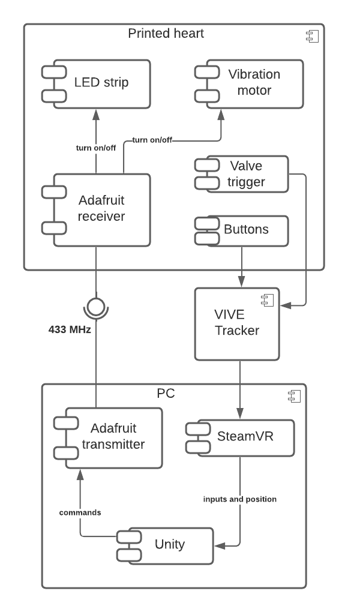

# OPEN PROJECT - HEALTH

Hier kleine Zusammenfassung über Projekt

- Studentenprojekt an HSD
- Unter Leitung von Laurin
- Geht um die virutelle / digitale Unterstützung der Lehre im medizinischen Bereich durch Tangibles
- 3D Objekt als Interface zur Veranschaulichung des menschlichen Herzens

## MOTIVATION

Hier vielleicht kurze Motivation wieso wir das Projekt gemacht haben und worum es nochmal genau geht

## OBJECTIVE

Hier kurz Zielsetzung und geplantes Outcome des Projektes

## APPROACH

- Wie sind wir vorgegangen?



### UNITY

- Standard Unity Projekt
- SteamVR hinzugefügt
- Zwei Skripte, um mit ViveTracker und Arduino zu kommunizieren

```bash
├── ViveTrackerTest
│   ├── Assets
│   │   ├── Scenes
│   │   │   ├── SampleScene.unity # Scene with example buttons and outputs
│   │   ├── Scripts
│   │   │   ├── ArduinoConnector.cs # Communication with Arduino
│   │   │   └── TrackerInput.cs # Communication with ViveTracker. Uses ArduinoConnector to send messages
│   │   ├── SteamVR
└── └── ... # Standard Unity project files
```

### ARDUINO

- Ein Adafruit, der an den PC per USB angeschlossen ist → Transmitter
- Ein Adafruit, der im Herz eingebaut ist → Receiver
- Kommunikation über 433 MHz Radio

```bash
├── arduino
│   ├── receiver
│   │   ├── receiver_led.ino # Receive messages on Adafruit connected to the heart
│   ├── transmitter
└── └── └── transmitter.ino # Send messages from Adafruit connected to PC
```

- TODO: Schaltplan

### SENDING AND RECEIVING DATA

Hier senden und empfangen erklären (Code)

### 3D MODEL

Hier Eigenschaften, Besonderheiten des Modells zeigen

- Welches Modell, wie bearbeitet?
- Wieso bearbeitet?

## OUTCOME

Hier fertigen Prototypen zeigen und kurz drauf eingehen

## ISSUES

Issues faced during development

## FUTURE WORK / OUTLOOK

Hier kurz Weiterentwicklungsmöglichkeiten, Optimierungsmöglichkeiten darlegen
